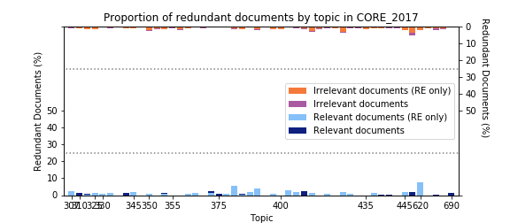
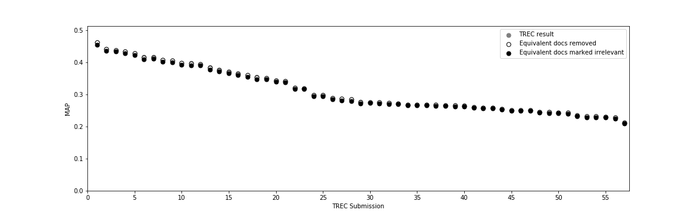
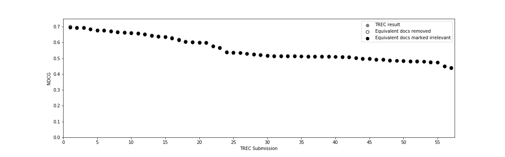

# Common Core 2017

## Redundancy within judged documents

With our preprocessing and S3 threshold of 0.68, we get:

## NDCG under Global Manipulation

## MAP under Global Manipulation

## NDCG under LOCAL Manipulation

## MAP under LOCAL Manipulation

