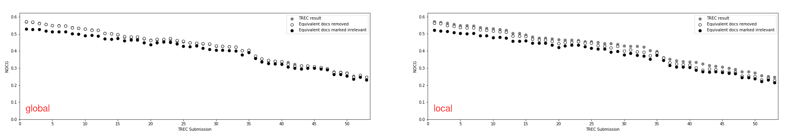
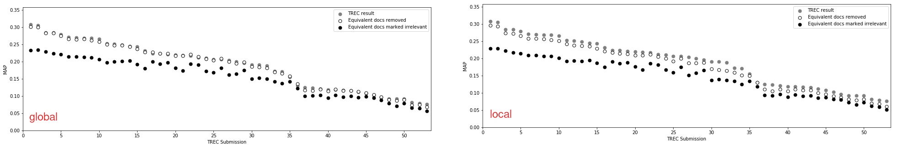
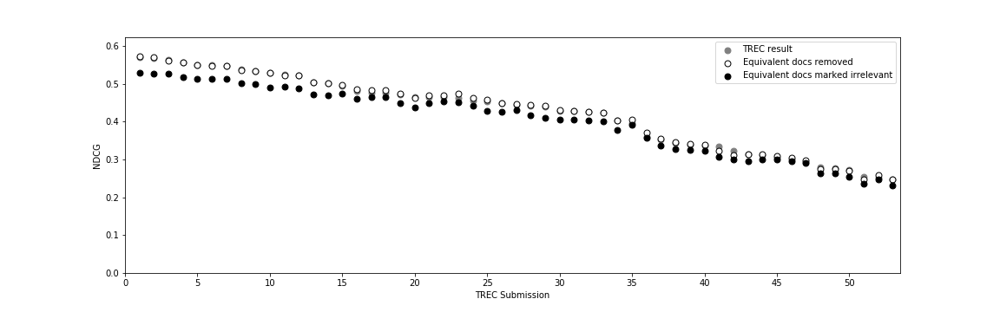
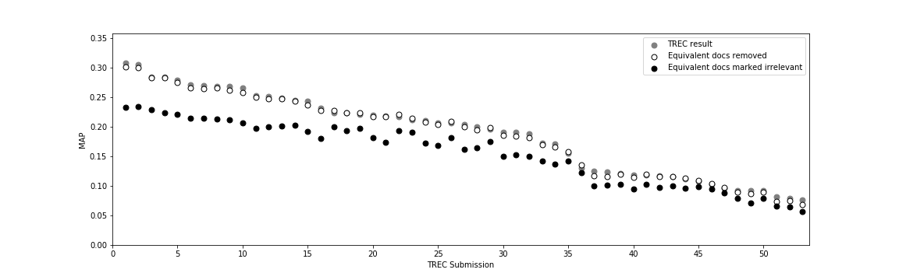

# Terabyte Track 2004

We reproduce the work of Bernstein and Zobel using local judgment manipulation (see: [Comparison of local and global manipulation of judgments](../../comparison-local-vs-global-qrel-manipulation/README.md)). Later, we show the same reports under different conditions.

## Reproduction

### Redundancy Within Judged Documents

With our preprocessing and S3 threshold of 0.68, we get:

We compare this with the plot reported by Bernstein and Zobel, and identify two differences regarding topic 748 (where we find more content-equivalent documents within the relevant documents than Bernstein and Zobel, but retrieval equivalence is identical),
and topic 707 (where we find more non-relevant content-equivalent documents than Bernstein and Zobel).

### Impact of Redundancy on Search Effectiveness

To reproduce the result of Bernstein and Zobel, we use `trec-eval` without any parameters. Please note that we report all values in our associated paper with the parameter `-M 1000`, since this reproduces the offical MAP scores reported in the overview-paper of terabyte 2004 (the scores are sligthly lower with `-M 1000`). Besides that, we used our preprocessing and the S3-Threshold of 0.68 to get:

We compare this with the plot reported by Bernstein and Zobel and can confirm that they are very similar and match in all characteristic points: See runs 11, 16, 20, 21, 29, 35, and 47.

With the parameter `-M 1000`, the plot changes in some details (mainly because the runs are sorted differently by the new "original" MAP):

## Repetition of the Experiments Under Different Conditions

We extend the work of Bernstein and Zobel and report the impact of classes of content-equivalent documents on search effectiveness for NDCG and MAP under global and local manipulation of judgments below.
We compare NDCG under global manipulation to NDCG under local manipulation. The local variant amplifies score changes:

This relationship is more subtle when we compare MAP under global manipulation to MAP under local manipulation. Additional, we observe much greater changes in MAP scores than for NDCG:

The points noted above seem to be consistent for all our experiments:

*  Local manipulation amplifies score changes (compare aggregations over [global manipulations](../../aggregations/README-GLOBAL.md) to [local manipulations](../../aggregations/README-LOCAL.md))
*  We observe much greater changes in MAP scores than for NDCG (compare the two tables listed within [the overview of global manipulations](../../aggregations/README-GLOBAL.md) and the two tables listed within [the overview of local manipulations](../../aggregations/README-LOCAL.md))

For completeness, we report the raw plots with the parameters that we have used to obtain them.

### NDCG under Global Manipulation

* S3-Threshold = 0.68, `trec-eval` with `-M 1000`

### MAP under Global Manipulation

* S3-Threshold = 0.68, `trec-eval` with `-M 1000`

### NDCG under LOCAL Manipulation

* S3-Threshold = 0.68, `trec-eval` with `-M 1000`

