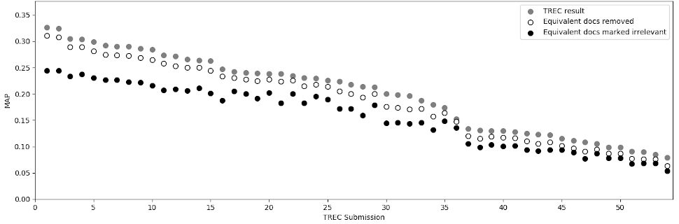
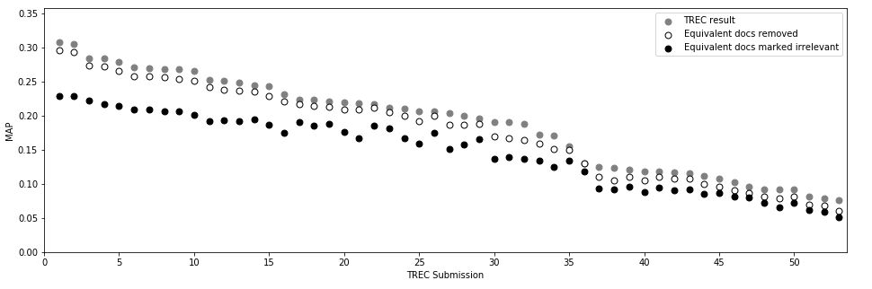

# Terabyte 2004

We reproduce the work of Bernstein and Zobel using local judgment manipulation (see: [Comparison of local and global manipulation of judgments](../../comparison-local-vs-global-qrel-manipulation/README.md)). Later, we show the same reports under other parameters.

## Reproduction

### Redundancy within judged documents

With our preprocessing and S3-Threshold of 0.68, we get:

We compare this with the plot reported by Bernstein and Zobel, and identify two differences regarding topic 748 (where we find more content-equivalent documents within the relevant documents then Bernstein and Zobel, but retrieval-equivalence is identical), and topic 707 (where we find more non-relevant content-equivalent documents then Bernstein and Zobel).

## Impact of Redundancy on search effectiveness

To reproduce the result of Bernstein and Zobel, we use `trec-eval` without any parameters. Please note that we report all values in our associated paper with the parameter `-M 1000`, since this reproduces the offical MAP scores reported in the overview-paper of terabyte 2004 (the scores are sligthly lower with `-M 1000`). Besides that, we used our preprocessing and the S3-Threshold of 0.68 to get:

We compare this with the plot reported by Bernstein and Zobel and can verify that they are very similar and match in all characteristic points: See runs 11, 16, 20, 21, 29, 35, and 47.

With the parameter `-M 1000`, the plot changes in some details (mainly because the runs are sorted differently by the new "original" MAP):

## NDCG under Global Manipulation

## MAP under Global Manipulation

## NDCG under LOCAL Manipulation
